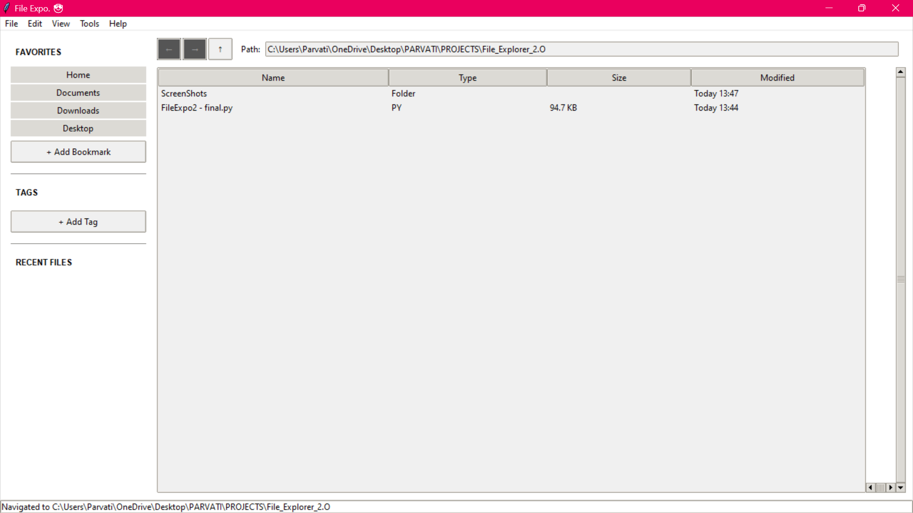
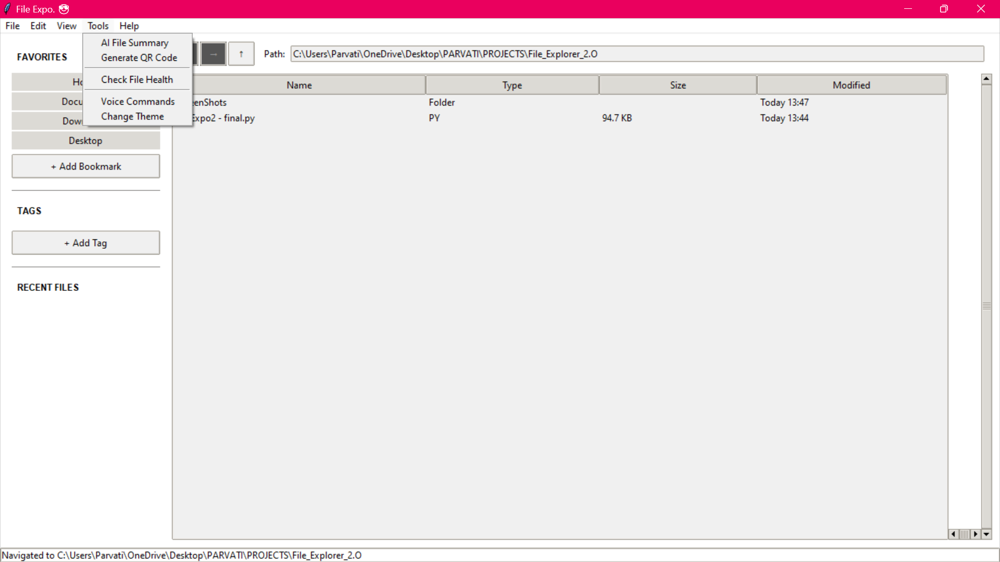
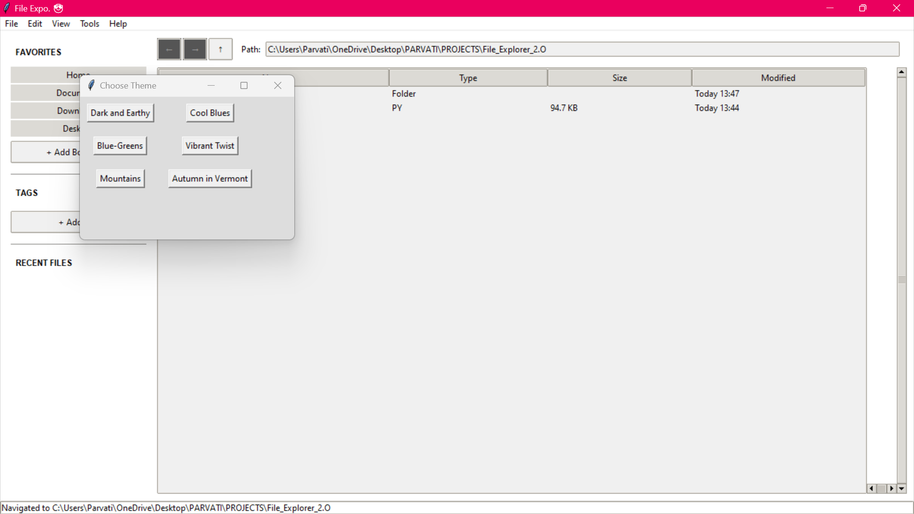
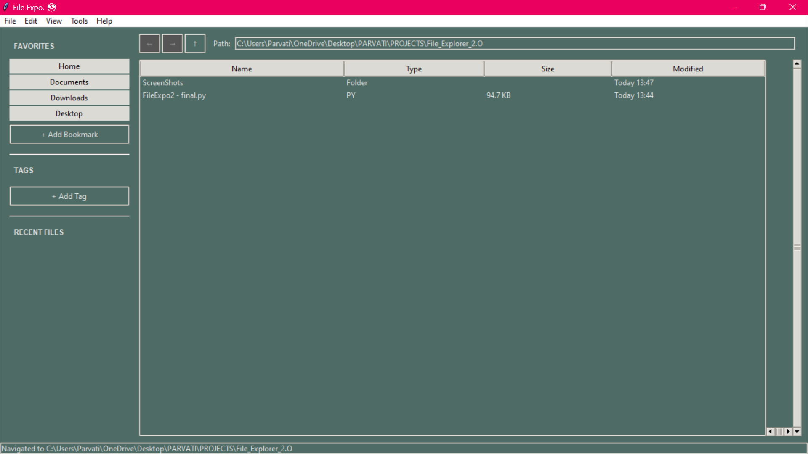

# 🗂️ File Explorer 2.0

File Explorer 2.0 is an advanced Python-based file manager with a modern GUI built using Tkinter. It mimics the experience of traditional file explorers while introducing powerful, user-friendly features like **manual file tagging**, **themes**, **QR Code for file sharing** (not fully functional yet), and **document summarization** for PDFs, DOCX, and PPTX.

---

## 🚀 Features

- 🖼️ **Graphical User Interface** (Tkinter-based)
- 🔍 **Themes**
- 🏷️ **Manual File Tagging System**
- 📄 **Smart Document Summarization** (PDF, DOCX, PPTX only)
- 🗃️ **Organized Navigation** (folders, back/forward, breadcrumbs)
- 🎤 **Voice Command Support** *(optional/experimental)*
- 📦 Modular Codebase (clean and easy to maintain)

---

## 📁 Tech Stack

- **Python (latest version)**
- **Tkinter** for GUI
- **Pillow** for image previews
- **OpenAI** for file summarization
- **SpeechRecognition** *(optional for voice commands)*

---

## 📷 Screenshots

<p align="center">
  
  
  
  
</p>

---

## 🛠️ Installation & Setup

```bash
# Clone the repository
git clone https://github.com/yourusername/File_Explorer_2.0.git
cd File_Explorer_2.0

# (Optional) Create and activate virtual environment
python -m venv venv
source venv/bin/activate  # On Windows: venv\Scripts\activate

# Install dependencies
pip install -r requirements.txt

# Run the app
python main.py
